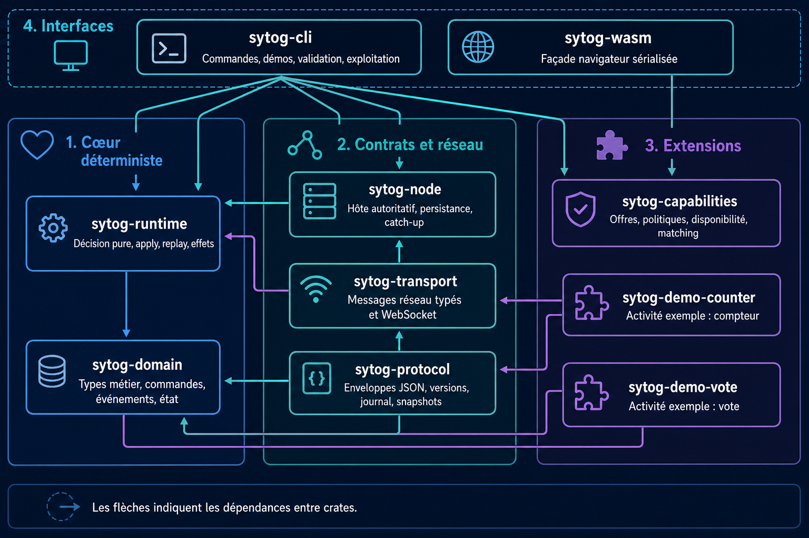

[Français](README.md) | [English](README.en.md)

# SYTOG

> SYTOG is a portable distributed runtime for synchronized sessions, activities
> and capabilities.

This repository contains a deliberately small V0 proving two independent paths:

- a deterministic session core: validated commands → immutable events → reducer,
  snapshot, journal, and replay;
- a functional capability registry: inventory, offers, local exposure policy,
  current availability, observations, and explainable deterministic matching.

SYTOG is not FFF, a game engine, an AI engine, or a cluster manager. Friends Fun
Factory is a product above SYTOG; GOTUS and PuzzleGuess integrate through
polyglot adapters; Noema implements AI capabilities; Delibra defines cognitive
workflows; Observatory/Probe owns empirical history.

## Repository

```text
crates/
  sytog-domain/        durable session types and reducer
  sytog-protocol/      versioned boundary envelopes
  sytog-runtime/       pure decision, effects, replay, and snapshots
  sytog-demo-counter/  example activity outside the generic core
  sytog-demo-vote/     second activity validating the extension seam
  sytog-transport/     network messages and WebSocket adapter
  sytog-node/          authoritative host and JSONL journal
  sytog-capabilities/  offers, policy, availability, and matching
  sytog-cli/           local demonstrations and file operations
  sytog-wasm/          narrow serialized browser façade
fixtures/              stable V0 protocol, log, job, and node contracts
docs/                  architecture, ADRs, guides, threat model, and roadmap
```

### Crate map



_Arrows indicate dependencies between crates. Module descriptions use the
canonical French terminology._

No empty transport or storage crates are present. Those adapters should appear
only when a real scenario needs them.

## Development

Rust 1.85.1 is pinned.

```bash
cargo fmt --all --check
cargo clippy --workspace --all-targets -- -D warnings
cargo test --workspace
cargo build -p sytog-wasm --target wasm32-unknown-unknown
cargo run -p sytog-cli -- demo session
cargo run -p sytog-cli -- demo capabilities
cargo run -p sytog-cli -- demo vote
cargo run -p sytog-cli -- --json capability match \
  fixtures/capabilities/job.json fixtures/capabilities/nodes.json
cargo run -p sytog-cli -- --json capability match \
  fixtures/capabilities/job-cpu.json fixtures/capabilities/nodes.json
cargo run -p sytog-cli -- replay fixtures/session/demo-event-log.json
cargo run -p sytog-cli -- validate fixtures/protocol/envelope-v1.json
```

### Local network session

In a first terminal:

```bash
cargo build -p sytog-cli
./target/debug/sytog serve --bind 127.0.0.1:7878
```

Then in two other terminals:

```bash
./target/debug/sytog connect ws://127.0.0.1:7878 --participant alice
./target/debug/sytog connect ws://127.0.0.1:7878 --participant bob
```

Interactive commands: `open tea coffee`, `vote coffee`, `close`, `state`,
`quit`. Each client keeps its local state under `data/clients/` and requests
missing events when reconnecting.

## Status

V0.2 adds a single-authority WebSocket host, a durable JSONL journal, and
reconnection catch-up to the deterministic V0.1 core. Cryptographic identity,
multiple authorities, remote execution, Media Sync, and product UIs remain
conceptual. See
[`docs/implementation-status.md`](docs/implementation-status.md).

## Documentation

French is the default language. Every new page should provide an English
counterpart and a reciprocal language switch. See the
[documentation convention](docs/README.en.md).
